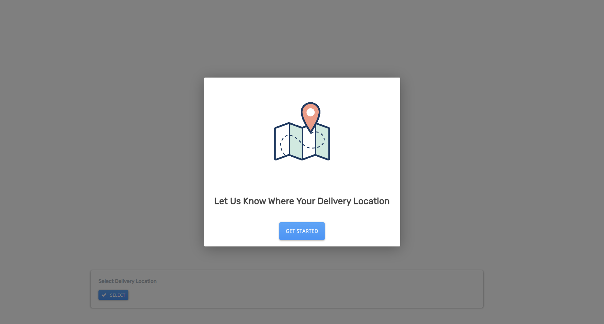

# Pin Location Map

This project provides a user-friendly map interface where you can view the addresses corresponding to specific coordinates. It aims to make it easier for users to understand the geographical location associated with particular pins on the map.

## Features

- **Pin Location Display**: See the exact location of pins on the map.
- **Address Conversion**: Easily convert coordinates into human-readable addresses.
- **Interactive Interface**: User-friendly interface for seamless navigation.

## Usage

1. **View Pin Locations**: Simply navigate through the map to view pin locations.
2. **Convert Coordinates to Addresses**: Click on a pin to see the corresponding address.

## Technologies Used

- **HTML/CSS/JavaScript**: Front-end development.
- **Mapping API**: Utilized for displaying the map and handling pin locations.
- **Geocoding Service**: Used to convert coordinates into addresses.

